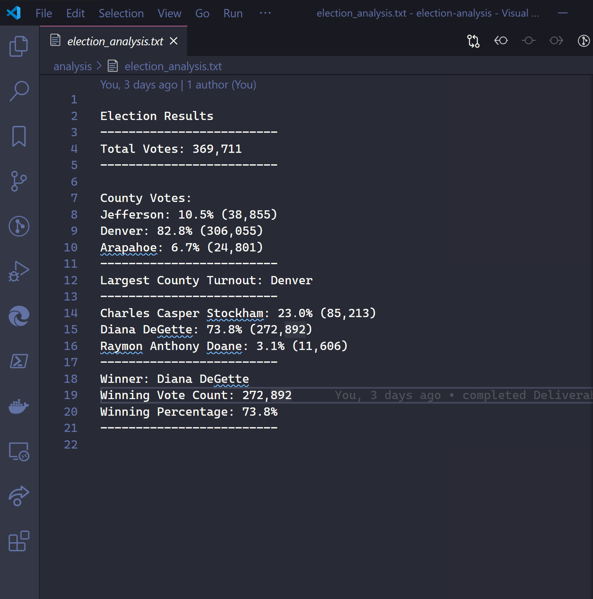

# Election Analysis

> Helping with Colorado's election with analysis using Python.

## Overview of Project

A Colorado Board of Elections employee has given you the following tasks to complete the election audit of a recent local congressional election using a set of programmatic tools of Python, Visual Studio Code, and Git.

## Summary

The analysis os the election show that:

Using Python and reading in the CSV election data set we determined out of the 369,711 votes some patterns and analysis.

We created a python script and would read and write data, performed calculations on the counts, and used loops and conditional statements to report our analysis.

- There were 369,711 votes cast in the election.
- The three candidates were:
  - Charles Casper Stockham
  - Diana DeGette
  - Raymon Anthony Doane
- With the candidate results being:
  - Charles Casper Stockham received 23.0% of the vote and 85,213 number of votes.
  - Diana DeGette received 73.8% of the vote and 272,892 number of votes.
  - Candidate 3 received 3.1% of the vote and 11,606 number of votes.
- The winner of the election was:
  - Diana DeGette, who received 73.8% of the vote and 272,892 number of votes.

### Resources

- Data Source: election_results.csv
- Client requirements
- Software: Python 3.7.7, Visual Studio Code, 1.47.3, Git 2.27

### Out Put Document

> We've submitted an outlined report located in the analysis folder under election_analysis.txt.

```
Election Results

---

#### Total Votes: 369,711

County Votes:
Jefferson: 10.5% (38,855)
Denver: 82.8% (306,055)
Arapahoe: 6.7% (24,801)

---

#### Largest County Turnout: Denver

Charles Casper Stockham: 23.0% (85,213)
Diana DeGette: 73.8% (272,892)
Raymon Anthony Doane: 3.1% (11,606)

---

Winner: Diana DeGette
Winning Vote Count: 272,892
Winning Percentage: 73.8%

---

```

## Challenge Overview

> We helped Seth and Tom submit the election audit results to the election commission.

1. The data we need to retrieve.
2. Capture and calculate the total number of votes cast through looping.\*
3. Get a complete list of candidates who received votes.
4. Calculate the total number of votes each candidate received.
5. Calculate the percentage of votes each candidate won.
6. Determine the winner of the election based on popular vote.

### Image of the looping logic to achieve the total number count.


### Election Audit Results

With the out file located in the resources folder we answer the following points and questions:

- How many votes were cast in this congressional election?
  - Total Votes: 369,711
- Provide a breakdown of the number of votes and the percentage of total votes for each county in the precinct.
  - County Votes:
  - Jefferson: 10.5% (38,855)
  - Denver: 82.8% (306,055)
  - Arapahoe: 6.7% (24,801)
- Which county had the largest number of votes?
  - Denver
- Provide a breakdown of the number of votes and the percentage of the total votes each candidate received.
  - Charles Casper Stockham: 23.0% (85,213)
  - Diana DeGette: 73.8% (272,892)
  - Raymon Anthony Doane: 3.1% (11,606)
- Which candidate won the election, what was their vote count, and what was their percentage of the total votes?
  - Winner: Diana DeGette
  - Winning Vote Count: 272,892
  - Winning Percentage: 73.8%

Colorado saw three counties tally up to 369,711 votes. The biggest of the counties with a 82.8% was Denver. We processed the votes for three candidates of Charles, Diana, and Raymon. With 73.8% of the votes towards Diana DeGette, that is 272,892 of the 369,711 total votes.

### Added Audit Analysis

The Election Commission has asked for further analysis into the election data. The questions on the calculate the voter turnout for each county that voted in the congressional district. How to calculate the percentage of votes each county contributed to the election. We also asked to determine which county had the largest turnout.



## Election Audit Summary

### Python, Git, and Visual Studio Code

When asked to be part of the analysis process we decided to do the work with Python in Visual Studio Code and committing changes with Git.

#### Learned with the tools

- Navigating to folders on your computer using the command line.
- Reading and extracting data from CSV files.
- Determining the difference between Python data types, like integers, floating-point decimal numbers, and strings.
- Performing mathematical operations using data types.
- Declaring variables using different data types.
- Creating and using data structures like lists, tuples, and dictionaries.
- Creating and using decision and repetition statements.
- Creating and using Boolean and logical operators.
- Writing data to an output file and print the file.

### Challenges and Difficulties Encountered

While learning Python, reviewing the code, building a sound script for analysis you could miss some creative ways to look at the data. You need a balance to engineering and data analysis.

## Todo Checklist

A helpful checklist to gauge how your README is coming on what I would like to finish:

- [ ] Refactor the Python Script to accept generic csv files that are not hard coded named.
- [ ] Display a map of the colorado area with census data mapped over.

## Contributing

Pull requests are welcome. For major changes, please open an issue first to discuss what you would like to change.

Please make sure to update tests as appropriate.

## License

[MIT](https://choosealicense.com/licenses/mit/)
